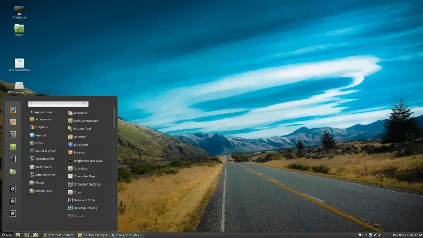

# Digital Security Guide
**Updated 3/2025**

## Oh Shit: I Think I Have a Breach

### Don't Panic

#### What kind of breach?
1. **Someone stole my credit card**
   - Call the credit card company or log on to your account immediately.
   - Cancel the compromised card.
   - Check [Experian](https://www.experian.com/), [TransUnion](https://www.transunion.com), and [Equifax](https://www.equifax.com) for unauthorized inquiries or opened accounts.
     - If unauthorized accounts exist, call the credit card companies and banks to close them.
   - Lock credit profile on [Experian](https://www.experian.com/), [TransUnion](https://www.transunion.com), and Equifax.
   - Lock SIM card.
2. **Someone stole my identity**
   - This is beyond the scope of this guide. See [usa.gov/identity-theft](https://www.usa.gov/identity-theft) for next steps.
3. **My info is on the internet**
   - What info?
     - If it's just name, address, or basic details → Check [Experian](https://www.experian.com/), [TransUnion](https://www.transunion.com), and Equifax; consider locking your credit (recommended unless needed unlocked).
     - Lock your SIM
     - If it's your SSN → Check credit reports and lock credit immediately if it's not already locked.
     - Monitor the situation—data breaches are common, but being a "hard target" reduces risk.

## Introduction

### Purpose of the Guide
This guide is designed to help individuals secure their online presence, protect sensitive information, and reduce risk exposure.

### Limitations of the Writers
We are not Cybersecurity professionals, but we have extensive experience in online security best practices. This guide is not meant to be all inclusive; we will give you a solid base to build upon. Remember: your identity is your responsibility.

### Expectations
This guide assumes a basic understanding of computer navigation. Complex tasks will be broken down with step-by-step instructions, including screenshots where needed.

## Table of Contents
1. [Principles of Security](#secion-1-principles-of-security)
2. [SIM Swapping](#section-2-sim-swapping)
3. [2FA is a Lie](#section-3-2fa-is-a-lie)
4. [Passwords](#section-4-passwords)
5. [Social Media](#section-5-social-media)
6. [SIM-Less Cellphone](#section-6-sim-les-cellphone)
7. [Ideal Setup Example](#section-7-ideal-setup-example)
8. Appendix A: [Checklist](#appendix-a-checklist)
9. Appendix B: [Step-by-step guides](#appendix-b-step-by-step-guides)
10. Appendix C: [Operating Systems](#appendix-c-operating-systems)
11. Appendix D: [Further Reading](#appendix-d-further-reading-and-useful-links)

## Section 1: Principles of Security

### Less is More
- If a website asks for unnecessary information, don't provide it.
  - A website asks for your birthday to verify your age? 
    - Lie about your birth date.
  - A website asking for a name to create an account that you don't need? 
    - Use an alias (John Smith, Jane Smith).
  - A website asking for an email for anything except banking? 
    - Use a throwaway email.
- The fewer personal details online, the less an attacker can piece together.

### You Will Never Be 100% Secure
- Security is like a puzzle: reduce the number of puzzle pieces available to bad actors and the bad actors will be less likely to get enough pieces to cause a breach.
- Become a "hard target"
  - The harder it is for a bad actor to get your information the more likely they will be to move to an easier target.
- Ways to reduce exposure:
  - Limit where and how you access sensitive accounts.
  - Avoid unnecessary credit and bank accounts and minimize financial institutions used.
  - Regularly monitor your online presence and credit reports.
    - You can use a scrubber like [OneRep](https://www.onerep.com) (see [Appendix](#appendix-d-further-reading-and-useful-links))
  - Use throwaway emails for unimportant things and secure emails for banking.

### Foundation is Important
- Operating systems matter:
  - Windows is the least secure.
  - [Linux](#linux-mint-cinnamon-the-windows-user's-linux)
  - Phones are inherently insecure.
- Internet of Things
  - Unsecured IoT devices (your security cameras, smart TVs, etc.) all introduce risk YOUR PHONE INCLUDED
  - If you need to have your laptop on the same network as IoT devices, consider increasing network security.
  - Always use a password to lock your device.
  - Never give IoT devices access to anything they don't absolutely need.
  - Never give IoT devices access to your firewall, router, or the internet.

### The Rabbit Hole
- The spectrum of security: No security → Full lockdown
- Full lockdown is impractical because daily function requires some risk.
- The goal is a balance between convenience and security.

## Section 2: SIM Swapping

### What is SIM Swapping?
SIM swapping (also called SIM hijacking or SIM swap fraud) is a type of identity theft where a hacker takes control of your phone number by transferring it to a SIM card they control. This allows them to intercept calls, texts, and two-factor authentication (2FA) codes, potentially giving them access to your online accounts, including banking and email.

### How SIM Swapping Works
1. **Gathering Personal Information** – Attackers use phishing, social engineering, data leaks, or hacking to obtain details like your name, phone number, and even answers to security questions. 
2. **Impersonating You** – The attacker contacts your mobile carrier, pretending to be you, and claims that they need to transfer your number to a new SIM card. 
3. **Convincing the Carrier** – They may provide stolen personal details or use bribery to convince customer service to switch the SIM to their device. 
4. **Taking Control** – Once the swap is successful, they receive all your calls, SMS, and 2FA messages, potentially leading to unauthorized access to your online accounts. 

### How to Protect Yourself from SIM Swapping
1. **Enable a SIM Lock PIN**
   - A SIM PIN prevents unauthorized access to your SIM card. 
   - To enable on Android: 
     - Go to Settings > Security > SIM Card Lock (varies by device). 
     - Enable "Lock SIM card" and set a PIN. 
   - To enable on iPhone: 
     - Go to Settings > Cellular > SIM PIN. 
     - Enable SIM PIN and set a strong code. 
2. **Set a Carrier-Level Security PIN**
   - Contact your mobile carrier and request a port-out PIN or account security PIN. 
   - This extra step prevents unauthorized transfers of your number. 
3. **Use App-Based 2FA Instead of SMS**
   - See [Section 3: 2FA is a Lie.](#section-3-2fa-is-a-lie)
4. **Beware of Phishing Attempts**
   - Do not click on suspicious links or provide personal information over the phone or via email. 
5. **Monitor for Unauthorized Account Changes**
   - If your phone suddenly loses service (without you making changes), contact your carrier immediately.

## Section 3: 2FA is a Lie

### The Problem
- Many companies implement Two-Factor Authentication (2FA) poorly.
- Backup methods (e.g., email fallback) significantly weaken security.
- If your email is compromised, attackers can reset all associated accounts and re-route the 2FA to a cell phone they control.

### The Right Way to Use 2FA
1. **Best option:** Security keys (e.g., Yubikey)
2. **Next best:** Authentication apps (Duo Mobile, Symantec VIP, Google Authenticator [for Apple], etc.)
3. **Avoid:** SMS-based 2FA whenever possible
   1. If avoidance is not possible, see [Section 6: SIM-Less Cellphones.](#section-6-sim-les-cellphone)
4. **Secure email:** Never use your everyday email for 2FA accounts. 
   1. If your email gets spam or you use it for social media, emailing friends or family, or work it should not be used for accounts that require 2FA.
   2. Your 2FA accounts should be backed up with a separate email that is hard to guess like your passwords.
   3. The password for your email should be kept with your other secured passwords and should be a Full ASCII Password (see [Section 4: Passwords](#section-4-passwords)).

## Section 4: Passwords

### Password Selection
- **Gold standard:** 20+ characters, mix of uppercase, lowercase, numbers, and symbols.
- **Full ASCII Passwords:** Extremely resistant to brute-force attacks.
- Use a random password generator (e.g., Avast Random Password Generator).

### Password Storage
- **Offline storage is best:**
  - Encrypted USB drive is the best option.
  - Paper is ultra-secure but impractical.
    - Write passwords down, printers can be compromised.
- **Password management:**
  - Alternative to offline storage
    - Bitwarden is the gold standard.
    - Free tier available.

### How to Secure a USB Drive for Password Storage
1. **Encrypt the USB drive using VeraCrypt.**
2. **Store passwords in a structured format** (e.g., spreadsheet, password manager file).

## Section 5: Social Media

### Reducing exposure on social media platforms is an essential security practice for several reasons:
1. **Minimizing Targeted Attacks**
   - Social media profiles often contain personal information that cybercriminals can exploit. They can use this data for phishing, social engineering, or identity theft. By limiting what is shared, you reduce the risk of being targeted by attackers who can craft convincing fake emails or messages based on your profile.
2. **Preventing Doxxing and Privacy Invasion**
   - Doxxing (the public release of private information) can be triggered by oversharing on social media. Even seemingly harmless posts can be combined to form a detailed picture of your life, making you vulnerable to harassment or stalking.
3. **Reducing the Risk of Social Engineering**
   - Social media platforms often reveal details like your job, location, or recent activities, all of which can be used to manipulate you into sharing sensitive information or granting access to your accounts. This is a common tactic in social engineering attacks, such as spear-phishing.
4. **Protecting Your Digital Footprint**
   - Anything shared on social media, whether it's photos, thoughts, or locations, contributes to your digital footprint. Reducing exposure limits the amount of information available for others to use in profiling you, potentially reducing risks like fraud or scams.
5. **Limiting Information for Data Brokers**
   - Many social media platforms gather and sell data to third parties, such as advertisers or data brokers. Reducing your social media footprint limits the amount of personal data that gets sold or misused.

### How to Reduce Exposure on Social Media:
1. **Review Privacy Settings:**
   - **Limit Public Access:** Ensure that your posts are only visible to people you trust. Make your profile private, or set limits on who can see your posts. 
   - **Control Who Can Follow You:** Restrict who can follow you or message you. 
   - **Hide Personal Information:** Avoid sharing your phone number, address, or specific location in your profile or posts. 
2. **Be Mindful of Posts and Shares:**
   - **Think Before Posting:** Be cautious about the content you share. If it reveals too much about your personal life, reconsider posting it. 
   - **Avoid Location Check-Ins:** Sharing your location in real-time makes you more vulnerable to threats like theft or stalking. 
   - **Limit Shared Media:** Photos or videos can inadvertently give away more than intended, such as locations or personal belongings. 
3. **Use Pseudonyms and Minimal Information:**
   - If possible, use pseudonyms or abbreviations for sensitive details. For example, instead of your full name, use initials or a nickname. 
   - Only share minimal information on profiles, avoiding the inclusion of things like your birthdate or full employment history. 
4. **Review Connections Regularly:**
   - Regularly check who follows or is connected to your profile. Remove people or connections that you don't recognize or trust. 
   - Disconnect from accounts or apps that you no longer use or that don't require access to your social media. 
5. **Be Cautious with Third-Party Apps:**
   - Revoke access to any third-party apps that you've connected to your social media accounts, especially those that don't provide value or are no longer in use. 
   - Use app permission settings to limit the scope of information you share with external apps. 
6. **Educate Yourself and Others:**
   - Understand common phishing tactics or social engineering schemes so you can recognize attempts to exploit your information. 
   - Educate friends and family about the importance of privacy and security on social media, as they may inadvertently expose you to risk through mutual connections.

## Advanced Security Practices

## Section 6: "SIM-Less" Cellphones
- Phones with no SIM card for 2FA apps prevent SIM swapping.
  - You can use an old cellphone connected to WiFi.
  - Download your 2FA apps (Duo Mobile, VIP, Symantec, etc.) and use the SIM-Less device when logging into high security accounts.
- Apps like Hushed allow secure 2FA SMS reception for a low cost.

## Section 7: Ideal Setup Example

### A Secure Digital Life
- Encrypted USB stick for passwords
- SIM-Less phone for 2FA apps
- Secret email for 2FA backup  
- Dedicated offline drive for backups
- Paper backups of passwords (handwritten in secure locations)
- Separate email for banking, fully isolated from all other accounts
- Yubikey for primary authentication when available
- High-security accounts linked to hardware authentication only with secret email for backup when required
- Linux or MacOS on desktop/laptop secured with a password

## Appendix A: Checklist

### Security Checklist
1. [ ] **Encrypted USB Stick for Passwords** 
   - [ ] Encrypt USB stick with strong encryption (e.g., AES-256)
   - [ ] Store passwords securely in an encrypted password manager on the USB stick
   - [ ] Keep USB stick in a secure, physically protected location
2. [ ] **SIM-Less Phone for 2FA Apps**
   - [ ] Use a phone without a SIM card for 2FA apps
   - [ ] Install 2FA apps (e.g., Google Authenticator, Authy, etc.) on this device
   - [ ] Secure the phone with a strong password and biometric authentication (if possible)
3. [ ] **Secret Email for 2FA Backup**
   - [ ] Create a separate email for 2FA backup (not linked to other accounts)
   - [ ] Enable strong 2FA (preferably with hardware key) on this email account
   - [ ] Store login details and recovery options in a secure location (e.g., encrypted USB stick)
4. [ ] **Dedicated Offline Drive for Backups**
   - [ ] Use a dedicated offline external drive for backups (no internet connection when not in use)
   - [ ] Encrypt the backup drive with strong encryption
   - [ ] Keep the offline drive in a secure location
5. [ ] **Paper Backups of Passwords**
   - [ ] Write passwords on paper, not digitally stored
   - [ ] Store paper backups in secure locations (e.g., safe or locked drawer)
   - [ ] Do not leave backups accessible or in public areas
6. [ ] **Separate Email for Banking (Fully Isolated)**
   - [ ] Create a unique email address for banking purposes
   - [ ] Do not link this email to other accounts or social media
   - [ ] Use 2FA with hardware authentication (e.g., Yubikey) on this email account
7. [ ] **Yubikey for Primary Authentication**
   - [ ] Use Yubikey (or similar hardware security key) for primary 2FA on supported accounts
   - [ ] Store Yubikey in a secure location (e.g., safe or lockbox)
   - [ ] Use Yubikey with all accounts that support hardware authentication
8. [ ] **High-Security Accounts Linked to Hardware Authentication**
   - [ ] Ensure high-security accounts (e.g., banking, email, sensitive services) are only linked to hardware authentication
   - [ ] Set up a backup process for account recovery via the secret email, if required
   - [ ] Regularly check that hardware authentication is working and up-to-date
9. [ ] **Linux or MacOS on Desktop/Laptop Secured with Password**
   - [ ] Set a strong password for Linux or macOS desktop/laptop accounts
   - [ ] Enable full disk encryption (e.g., LUKS for Linux, FileVault for macOS)
   - [ ] Keep the operating system and software updated to the latest security patches

## Appendix B: Step-by-step guides

### 🔐 How to Encrypt a USB Drive with VeraCrypt
1. **Install VeraCrypt**
   - Download it from veracrypt.eu. 
   - Install it on your Windows machine/Mac OS/Linux distro. 
2. **Choose Encryption Type**
   You have two options:
   1. Encrypt the entire USB drive – Requires formatting, meaning you will lose all existing data. 
   2. Create an encrypted file container – Stores encrypted files within a normal file on the USB, allowing you to keep existing data. 
3. **Encrypt the Entire USB Drive (Recommended for Maximum Security)**
   - Open VeraCrypt → Click Create Volume. 
   - Choose Encrypt a non-system partition/drive. 
   - Select Standard VeraCrypt volume. 
   - Pick your USB drive from the list. 
   - Choose AES (default, strong and fast) or another encryption algorithm. 
   - Set a strong password (at least 20+ characters). 
   - Move your mouse randomly to generate entropy. 
   - Click Format (⚠️ This erases the drive). 
   - Once complete, mount the USB in VeraCrypt whenever you need access. 
4. **(Alternative) Create an Encrypted File Container**
   - If you don't want to format the USB, create a VeraCrypt file container: 
     - Open VeraCrypt → Create Volume → Create an encrypted file container. 
     - Choose a location on the USB drive. 
     - Set size, encryption settings, and password. 
     - Use VeraCrypt to mount the container when needed. 
5. **Using Your Encrypted USB**
   - To access the encrypted volume, open VeraCrypt, select the USB drive, click Mount, and enter your password. 
   - Once mounted, it acts like a normal drive. 
   - To securely remove it, click Dismount in VeraCrypt before unplugging. 

### ✅ Pros of Using VeraCrypt for USB Encryption
- Works on any Windows version (Unlike BitLocker, which requires Windows Pro/Enterprise). 
- Strong encryption (AES, Serpent, Twofish). 
- Hidden volume support (Plausible deniability). 
- Cross-platform (Can be mounted on Linux & macOS with VeraCrypt installed). 

### ❌ Cons
- Requires VeraCrypt to access files (not as seamless as BitLocker). 
- No auto-unlock on trusted PCs (unlike BitLocker with TPM). 
- Performance impact (encrypted reads/writes are slightly slower, especially on HDD-based USBs). 

### 🔥 Alternative for Simplicity
- If you're on Windows Pro/Enterprise, BitLocker To Go offers seamless encryption with no additional software required. 
- If you need something cross-platform with no software installation, use 7-Zip or Cryptomator for individual file encryption.

## How to Setup Bitwarden
### Step 1: Create a Bitwarden Account
1. Go to the Bitwarden website. 
2. Click Get Started. 
3. Select Sign Up to create an account. 
4. Enter your email address, master password, and confirm your password. The master password is crucial as it encrypts your vault, so choose a strong one. 
5. Agree to the terms of service and privacy policy. 
6. Click Submit. 
7. Check your email inbox for a verification email from Bitwarden. Click the verification link to complete your sign-up. 

### Step 2: Install Bitwarden on Your Devices
1. **Browser Extension (Chrome, Firefox, Safari, Edge, etc.):**
   - Visit the Bitwarden browser extension page for your specific browser. 
   - Click Add to [Browser]. 
   - After installation, click the Bitwarden icon in your browser toolbar to log in with your email and master password. 
2. **Desktop Application (Windows, macOS, or Linux):**
   - Download the Bitwarden app for your platform from the Bitwarden download page. 
   - After installation, open the app and log in with your email and master password. 
3. **Mobile Application (iOS or Android):**
   - Open your respective app store (App Store for iOS or Google Play for Android). 
   - Search for Bitwarden and install the app. 
   - Launch the app and log in with your email and master password. 

### Step 3: Set Up Two-Factor Authentication (2FA)
For enhanced security, it's recommended to enable 2FA.
1. In the Bitwarden web vault or app, go to your Account Settings. 
2. Look for Two-step Login under the security section. 
3. You can use an authentication app (such as Google Authenticator or Authy) or a hardware security key (like YubiKey) for 2FA. 
4. Follow the on-screen instructions to set up 2FA: 
   - If using an authenticator app, scan the QR code or enter the key provided by Bitwarden into the app. 
   - Enter the code from the app to verify. 
5. Backup codes will be provided for recovery in case you lose access to your 2FA method—store them safely. 

### Step 4: Add Your First Password Entry
1. After logging into Bitwarden, you'll be directed to the Vault. 
2. Click Add Item to add a new password. 
3. Choose the Login type. 
4. Enter a name (e.g., the website or service name), username, and password. 
5. You can optionally add more details like a URL and notes. 
6. Click Save to add the entry to your vault. 

### Step 5: Using the Bitwarden Password Generator
Bitwarden comes with a built-in password generator to create strong, random passwords:
1. In the vault, click the Password Generator (the key icon). 
2. Customize the settings (length, characters, etc.). 
3. Click Generate to create a new password. 
4. Copy the password and save it in your vault under the relevant login. 

### Step 6: Install the Bitwarden Browser Extension for Autofill
1. After installing the browser extension, log in with your account. 
2. Visit any website where you have a saved login. 
3. Bitwarden will automatically suggest credentials for the login. 
4. Click the Bitwarden icon in your browser and choose the login you want to autofill. 

### Step 7: Organize Your Vault
1. You can organize your saved passwords by creating folders. 
2. In the vault, click Add Folder and name it (e.g., "Work", "Personal"). 
3. Drag and drop items into the relevant folders for easier access. 

### Step 8: Sync Across Devices
1. As you add, modify, or remove entries from your vault, it will automatically sync across all your devices as long as you are logged into the same account. 

### Step 9: Backup and Export Your Vault (Optional)
1. To create a backup or export your vault: 
   - Go to your Vault. 
   - Click the Settings (gear icon) in the web vault or app. 
   - Choose Export Vault to create a CSV file with all your entries (be cautious with this, as the file will not be encrypted). 
2. You can also set up automatic backups depending on your device. 

### Step 10: Use Bitwarden's Premium Features (Optional)
1. Bitwarden offers premium features for a small fee (about $10/year): 
   - Encrypted file storage. 
   - Advanced 2FA options (e.g., FIDO2/WebAuthn). 
   - Emergency access. 
   - Priority customer support. 
2. You can upgrade your account to premium by visiting the Account Settings. 

### Step 11: Self-Hosting (Optional)
1. Bitwarden allows you to self-host your instance if you want full control over your data. 
2. Follow the instructions on the Bitwarden self-hosting page for the setup process. This typically involves setting up a Docker container on a server.

## Appendix C: Operating Systems

### Windows Security Issues & Zero-Day Breaches
Windows, being the most widely used operating system, is a prime target for cyber-attacks. Here's why:
#### 🔹 Common Windows Security Issues
1. **High Malware & Ransomware Risk** – Since most computers run Windows, hackers develop more malware for it than for any other OS. 
2. **Zero-Day Vulnerabilities** – Microsoft regularly patches security flaws, but attackers often exploit unknown bugs before fixes are available. 
3. **Telemetry & Data Collection** – Windows 10/11 collect user data by default, raising privacy concerns. 
4. **Forced Updates** – While updates are meant for security, they can sometimes break the system or introduce new issues. 
5. **User Permissions & Phishing Risks** – Many users run Windows with full administrator privileges, making it easier for malware to spread if they download a malicious file. 

#### 🛑 What is a Zero-Day Breach?
A zero-day vulnerability is a security flaw that is unknown to the software maker (Microsoft) and remains unpatched until it is discovered and fixed.

#### 🚨 Zero-Day Exploit Process:
1. A hacker finds an unknown flaw in Windows. 
2. They create malware to exploit this weakness. 
3. Victims are infected before Microsoft releases a patch. 
4. Microsoft rushes to release a security update (patch). 

#### 🔹 Examples of Zero-Day Attacks:
- **PrintNightmare (2021)** – Allowed remote code execution via Windows Print Spooler. 
- **Follina (2022)** – Used malicious Word documents to take control of PCs. 
- **MOVEit (2023)** – Exploited file transfer software used by Windows servers. 

### How to Protect Against Windows Security Risks
✅ Keep Windows Updated – Install security patches ASAP.  
✅ Use Standard (Non-Admin) Accounts – Prevent malware from running system-wide.  
✅ Use a Firewall & Antivirus – Windows Defender is good but not foolproof.  
✅ Be Cautious with Downloads & Links – Avoid shady websites & email attachments.  
✅ Consider Alternative OS Options – Linux (like Mint) is less vulnerable to these types of attacks.

### Linux Mint Cinnamon – The Windows User's Linux
If you've never used Linux before and want something that feels familiar, Linux Mint Cinnamon is the best place to start. It's designed to be easy to use, lightweight, and stable, making it perfect for beginners and Windows switchers.

#### What is Linux Mint Cinnamon?
Linux Mint is a free and open-source operating system based on Ubuntu (one of the most popular Linux distributions). It has multiple desktop environments, but the Cinnamon Edition is the most Windows-like, offering a familiar layout with a Start Menu, taskbar, system tray, and file explorer.

*(Example of Linux Mint Cinnamon's desktop – looks a lot like Windows!)*
 
*(Image credit ExtremeTech.com)*

### Pros & Cons of Linux Mint Cinnamon
#### ✅ Pros (Advantages)
- **Windows-like Interface** – If you've used Windows, you'll feel at home. The Start Menu, taskbar, and file manager are very similar.
- **Stable & Reliable** – Based on Ubuntu's Long-Term Support (LTS) releases, meaning it gets security updates for years without major changes.
- **Lightweight & Fast** – Runs well even on older computers (less resource-intensive than Windows).
- **Free & No Bloatware** – No annoying ads, forced updates, or unnecessary programs slowing things down.
- **Easy Software Installation** – Comes with an app store called Software Manager, where you can install apps with one click.
- **Great for Privacy & Security** – No telemetry (data collection) like Windows 10/11.

#### ❌ Cons (Disadvantages)
- **Not for Gaming (by default)** – While many Windows games work using Steam Proton or Lutris, not all games are supported natively.
- **Less Software Compatibility** – Windows-only apps (like Microsoft Office or Adobe Photoshop) require workarounds (e.g., Linux alternatives, Wine or Virtual Machines).
- **Learning Curve** – Some things work differently than Windows, like installing drivers or running .exe files.
- **Hardware Compatibility Issues** – Some very new laptops (especially gaming laptops) may need additional driver setup.

### Security: How Does Linux Mint Compare to Windows?
🛡️ Linux Mint is Generally More Secure Than Windows
1. **No Built-in Spyware or Data Collection** – Windows constantly collects user data unless you manually disable it. Linux Mint has zero telemetry. 
2. **Fewer Viruses & Malware** – Most malware is designed for Windows. While Linux can technically get viruses, it's extremely rare. 
3. **No Need for Antivirus** – On Windows, you need antivirus software. On Linux Mint, you generally don't. 
4. **Software Comes from Trusted Repositories** – Instead of downloading programs from random websites (like in Windows), you install apps through Software Manager, which ensures safety. 
5. **Automatic Security Updates** – The update manager lets you install security patches without interrupting your work. 

🔹 However, security depends on the user. If you install random software from unknown sources or disable security features, you can still get into trouble.

### Basic Maintenance: GUI-Based Tasks
Even if you're not familiar with Linux, keeping Linux Mint running smoothly is easy. Here's how you can handle basic maintenance using the graphical interface (GUI).
1. **Update Your System (Like Windows Update)**
   - Click on the Update Manager (shield icon in the taskbar). 
   - Click Refresh to check for updates. 
   - Click Install Updates to keep your system secure and up to date. 
   - 🔹 How often? – Once a week is usually enough.

2. **Install & Remove Software (Like Windows' App Store)**
   - Open Software Manager (like Microsoft Store). 
   - Search for an app (e.g., "Google Chrome"). 
   - Click Install to add it. 
   - To uninstall, go to Installed Applications, find the app, and click Remove. 
   - 🔹 How often? – As needed.

3. **Clean Up Your System (Like Windows Disk Cleanup)**
   - Open System Settings > Startup Applications and disable unnecessary apps. 
   - Open Update Manager > View > Linux Kernels and remove old kernels you don't need. 
   - Open Timeshift to manage system snapshots and delete old backups. 
   - �� How often? – Every few months.

4. **Check System Resources (Like Task Manager)**
   - Press Ctrl + Alt + Del (or open System Monitor). 
   - Check which apps are using CPU/RAM. 
   - Close any unneeded apps. 
   - 🔹 How often? – If your system feels slow.

5. **Enable Automatic Backups (Like System Restore)**
   - Open Timeshift. 
   - Choose where to save backups (external drive recommended). 
   - Set it to take snapshots automatically. 
   - 🔹 How often? – Weekly for safety.

### Final Thoughts: Is Linux Mint Cinnamon Right for You?
✅ Choose Linux Mint Cinnamon if you:
- Want a free, fast, and secure alternative to Windows. 
- Prefer a familiar interface with minimal learning curve. 
- Need stability and long-term support. 

❌ Avoid it if you:
- Need to run a lot of Windows-only software (without alternatives). 
- Are a hardcore gamer who relies on anti-cheat-protected games. 

If you're ready to try Linux Mint, you can download it from [linuxmint.com](https://www.linuxmint.com), create a bootable USB, and test it without installing it using the "Live Mode."

## Appendix D: Further Reading and Useful Links
1. **Linux Mint**
   - Install guide
2. **Bitwarden**
   - [Bitwarden: Getting Started](https://bitwarden.com/getting-started/)
   - [Bitwarden Whitepaper](https://bitwarden.com/whitepaper/)
3. **Yubico**
   - [Yubico: Security Keys Overview](https://www.yubico.com/product/yubikey-hardware-security-key/)
   - [Yubico's 2FA Guide](https://www.yubico.com/solutions/two-factor-authentication/)
4. **Duo Mobile**
   - [Duo Security: Two-Factor Authentication](https://duo.com/product/multi-factor-authentication)
   - [Duo Android Mobile App](https://play.google.com/store/apps/details?id=com.duosecurity.duomobile)
   - [Duo MacOS App](https://duo.com/docs/duomobile-macos)
5. **Symantec VIP (VIP Access)**
   - [Symantec VIP Overview](https://www.broadcom.com/company/newsroom/press-releases?filtr=VIP)
   - [Symantec VIP Support](https://support.broadcom.com/)
6. **VeraCrypt**
   - [VeraCrypt Documentation](https://www.veracrypt.fr/en/Documentation.html)
   - [VeraCrypt Guide to Full Disk Encryption](https://www.veracrypt.fr/en/Full_Disk_Encryption.html)
7. **SIM Swapping**
   - [What is SIM Swapping?](https://www.consumer.ftc.gov/articles/what-sim-swapping)
   - [Preventing SIM Swapping](https://www.consumer.ftc.gov/articles/preventing-sim-swapping)
8. **Two-Factor Authentication (2FA)** 
   - [Google 2-Step Verification Guide](https://support.google.com/accounts/answer/185201)
   - [FTC.gov 2FA Advice](https://www.consumer.ftc.gov/articles/how-use-two-factor-authentication)
9. **Zero-Day Vulnerabilities**
   - [Zero-Day Exploit Overview](https://www.csoonline.com/article/3531230/what-is-a-zero-day-exploit.html)
   - [Zero-Day Vulnerabilities](https://www.csoonline.com/article/3531230/what-is-a-zero-day-vulnerability.html)
10. **AI Privacy**
    - [AI and Data Privacy Considerations](https://www.privacyinternational.org/)
11. **Avast Random Password Generator**
    - [Avast Free Password Generator](https://www.avast.com/en-us/free-password-generator)
    - [Password Management Best Practices](https://www.avast.com/c-password-management)
12. **Social Media Security**
    - [Keeping safe on social media](https://www.consumer.ftc.gov/articles/what-know-about-social-media)
13. **Identity Theft Insurance**
    - [Allstate Identity Theft](https://www.allstate.com/identity-theft-insurance.aspx)
14. **Credit Reporting Agencies (TransUnion, Equifax, Experian)**
    - [TransUnion Credit Monitoring](https://www.transunion.com/)
    - [Equifax Security Center](https://www.equifax.com/personal/)
    - [Experian Fraud Protection](https://www.experian.com/fraud/)
15. **Identity Theft Resources**
    - [IdentityTheft.gov](https://www.identitytheft.gov/)
    - [FTC.gov](https://www.ftc.gov/)
16. **OneRep**
    - [OneRep](https://www.onerep.com) is a privacy and security service that helps individuals remove their personal information from various data broker websites. These websites collect, aggregate, and sell personal data, which can lead to privacy concerns and unwanted solicitations. OneRep scans these data broker sites and assists users in removing their information from their databases, thereby reducing the risk of identity theft, spam, and unwanted attention.
      - **Scanning:** OneRep scans numerous data broker websites to identify where your personal information is being shared. 
      - **Removal Process:** After scanning, OneRep attempts to remove your information from these sites. This can involve submitting requests or following processes required by the data brokers. 
      - **Ongoing Monitoring:** OneRep continuously monitors for new instances of your information appearing on data broker sites and initiates removal requests to keep your data private.

